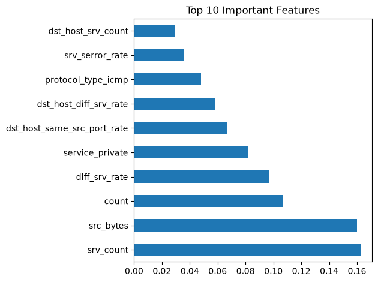
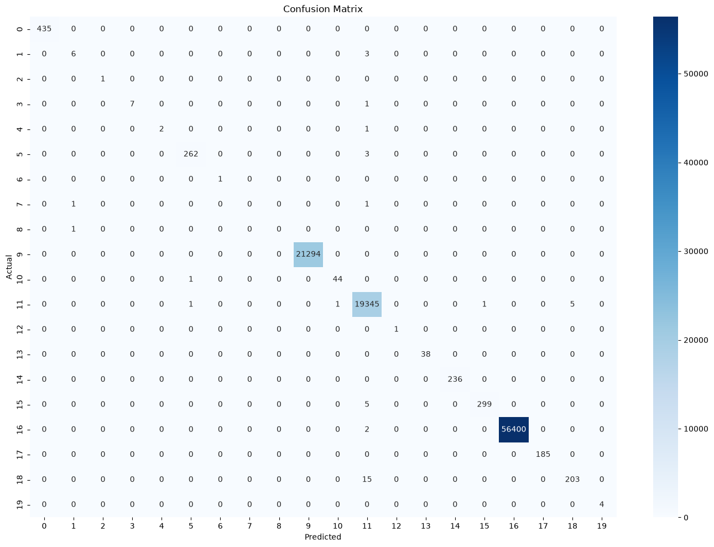

# KDD Cup 99 - Network Intrusion Detection System

A machine learning project that detects network intrusions using the KDD Cup 1999 dataset. Built with Random Forest classifier achieving **99.96% accuracy** across 20 attack categories.

## Project Overview

Network intrusion detection is a critical cybersecurity task. This project trains a Random Forest model on the KDD Cup 99 benchmark dataset to classify network traffic as either normal or one of 19 known attack types.

## Results

| Metric | Score |
|--------|-------|
| Accuracy | 99.96% |
| Weighted F1-Score | 1.00 |
| Test Samples | 98,805 |

### Attack Types Detected
`neptune` `smurf` `normal` `back` `satan` `ipsweep` `portsweep` `warezclient` `teardrop` `pod` `nmap` `guess_passwd` `buffer_overflow` `warezmaster` `imap` `ftp_write` `multihop` `perl` `land`

## Visualizations

### Top 10 Important Features


### Confusion Matrix


## Tech Stack

- Python 3.13
- scikit-learn (Random Forest)
- pandas (data loading & preprocessing)
- matplotlib & seaborn (visualization)

## How to Run

### 1. Clone the repository
```bash
git clone https://github.com/AkshayEtukuri/KDD-Intrusion-Detection.git
cd KDD-Intrusion-Detection
```

### 2. Install dependencies
```bash
pip install pandas scikit-learn matplotlib seaborn
```

### 3. Download the dataset
Download from the [KDD Cup 99 UCI Repository](http://kdd.ics.uci.edu/databases/kddcup99/kddcup99.html) and place it in a folder named `KDD_Cup_Data/`.

The script uses: `KDD_Cup_Data/kddcup.data_10_percent.gz`

### 4. Run the project
```bash
python project.py
```

Outputs saved: `feature_importance.png`, `confusion_matrix.png`

## Dataset

- **Source:** KDD Cup 1999 (UCI ML Repository)
- **Subset used:** 10% training data (~494,000 records)
- **Features:** 41 network traffic features
- **Classes:** 20 (normal + 19 attack types)

## Author

**Akshay Etukuri**  
B.Tech CSE (Networks) — Malla Reddy Institute of Technology & Science  
[GitHub](https://github.com/AkshayEtukuri)
